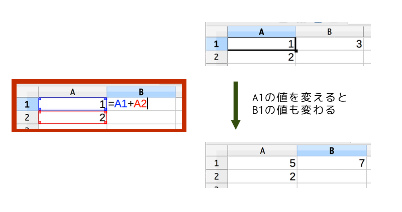
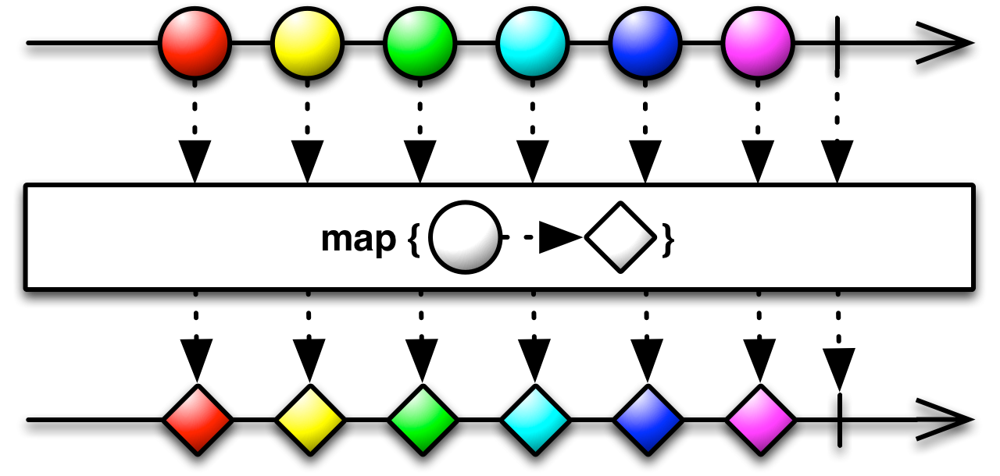
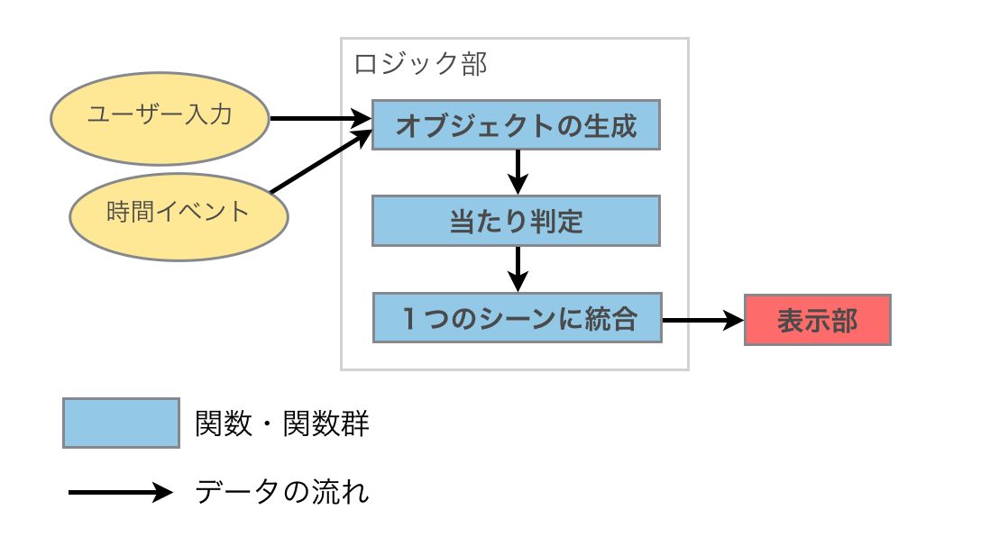
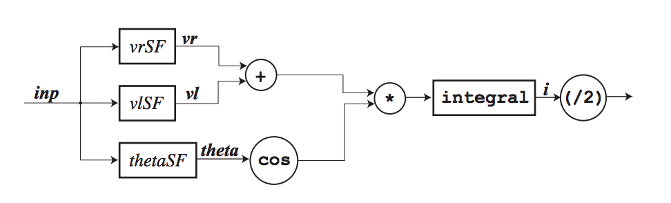

class: center, middle

# Elm - Functional Reactive Programming

---

## 今日の話
 * Functional Reactive Programming というプログラミングのパラダイムについての話
 * 主題は「Elmというプログラミング言語で二重振り子を作った」
 * 分かりやすい説明を心がけることができませんでした…
 * 関数型プログラミングの諸々の説明は端折る
---

## Reactive Programming

> A programming paradigm oriented around **data flows** and **the  propagation of change**

 (Wikipedia)

---

## 例 : Excel



---

## 例 : 仮想コード
```javascript
var t = getTime // 現在の経過時間を動的に表す
print(t * 10) // 現在の経過時間を10倍して表示
```
<div id="hoge"></div>

---

## Functional Programming
* 宣言的プログラミング (Declarative Programming)
* 参照透過性 (文脈によらず式の値はその構成要素によってのみ定まる)
* 副作用(状態や変更可能な値)を避ける

---
class: center, middle

## 例
*最初の100個の自然数について二乗の和と和の二乗の差を求めよ.*

(Project Euler 6)

---

## 例 : Imperative; Non-Functional (C)

```c
int sum_of_squares = 0;
int square_of_sum, sum = 0;
for(int n=1; n<=100; ++n){
    sum_of_squares += n * n;
    sum += n;
}
square_of_sum = sum * sum;
int answer = square_of_sum - sum_of_squares;
```

---

## 例 : Functional (Haskell)
```haskell
let sum_of_squares = sum (map (^2) [1..100])
let square_of_sum = (sum [1..100])^2
let answer = square_of_sum - sum_of_squares
```

---

## いろいろな関数
* 関数合成 `f . g`
  * (f . g)(x) = f(g(x))
* 高階関数 `map`
  * map f [a0, a1, ... , an] = [f(a0), f(a1), ... , f(an)]

---

## Functional Reactive Programming

> **Functional reactive programming** (FRP) is a programming paradigm for reactive programming (asynchronous dataflow programming) using the building blocks of functional programming (e.g. map, reduce, filter).

(Wikipedia)

---

## Functional Reactive Programming

* 時間軸に沿って入ってくるデータを関数への入力とする
  * キー入力
  * 1秒ごとのイベント
  * ボタンの押下
* 時系列を配列のようにみなす→時系列に対してmapやreduceなどの関数で処理できる



[4]

---

## 例: 「X」キーが押されたら画面にXと表示する
* hoge関数の入力にキーイベントデータを流し込めば良い
* `hoge = (map showChar) . (filter isX) . (map toKeyCode)`
    * `toKeyCode` キーコードを文字に変換する関数 :: Int -> Char
    * `isX` 「X」の時のみTrueになる関数 :: Char -> Boolean
    * `showChar` 与えられた文字を表示する関数 :: Char -> ()
* 役割(関数)を細分化してモジュール性を高めることで見通しのよいコードになる

---
class: center, middle

## 本題: Elm

---

## Elm (http://elm-lang.org/)
* FRPでWebプログラミング
* Haskell-like な言語 (純粋関数型)
* Elm コードから HTML, CSS, JavaScript を生成
* Canvas や Form が標準で扱え、ライブラリでWebGLなども扱える

---

## Signal
* 時系列により変化するデータをハンドリングするオブジェクト(Functor)
* イベント(キー入力やボタン)や時間を扱える
* 例
    * `Time.fps : Int -> Signal Int`
        * 1秒間にSignalをn回出力する
    * `Mouse.position : Signal (Int, Int)`
        * マウスの位置を出力する（マウスが動くたびに値を出力）
---

## 例: マウスの位置を表示

```elm
main = Signal.map asText Mouse.position
```
http://elm-lang.org/edit/examples/Reactive/Position.elm
* `asText : a -> Element`
    * 受け取ったデータをHTMLの要素として返す
* `Signal.map : (a -> b) -> Signal a -> Signal b`
    * 各Signalデータそれぞれに対し関数を実行
---

## デモ:二重振り子(今回のメイン)
[Demo](./double_pendulum.html)
[Source Code](https://github.com/45deg/45deg.github.io/blob/master/rogysemi6th-slide/double_pendulum.elm)

---

## Elm Debugger
* 時間にフックすることで時間操作が可能になる
* 多分フル活用すればめっちゃ便利だと思う
* http://debug.elm-lang.org/

---

## FRPの使い道: ゲーム
 * 時間データやキー入力データ等色々なデータが入ってくる
 * 「データ」中心のプログラミングが出来るので、プロセスやロジックの分離が可能になり、見通しの良いプログラムに



---

## FRPの使い道: ロボット
 * 時間データやセンサーからのデータ等色々なデータが入ってくる
 * 制御システムのフローチャートをそのままプログラムに落とし込める



[1]

---

## FRPの言語とかライブラリとか
 * Elm
 * Haskell Library
    * Yampa
    * Ractive
    * Elerea
 * Rx (.NET)
 * RxJava
 * JS Library
    * Bacon.js
    * RxJS
    * Ractive.js
    * Flapjax
    * Kefir.js
    * ...
 * ...
---

## 参考文献
 1. Paul Hudak, et al. Arrows, Robots, and Functional Reactive Programming http://www.cs.nott.ac.uk/~nhn/Publications/afp2002.pdf
 2. Elm lang http://elm-lang.org/
 3. やさしいFunctional reactive programming（概要編） http://maoe.hatenadiary.jp/entry/20100109/1263059731
 4. ReactiveX http://reactivex.io/

---
class: middle
# ご清聴ありがとうございました
